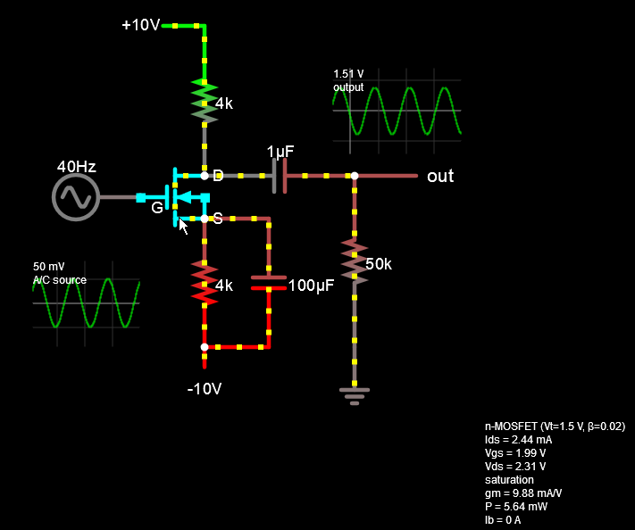

### CircuitJS1 - Electronic Circuit Simulation in your Browser

| Repository | Version | Status | Avg Time | Last Commit |
|:---------- |:------  |:------ |:-------- |:----------- |
| **This**   | `2.2.3` | [![Maintenance][5]][6] | [![Average time to resolve an issue][9]][10] | [![GitHub last commit][7]][8] |
| [*Original*](https://github.com/pfalstad/circuitjs1) | `2.2.3` | [![Maintenance][11]][12] | [![Average time to resolve an issue][15]][16] | [![GitHub last commit][13]][14] |


[5]: https://img.shields.io/badge/Maintained%3F-yes-green.svg
[6]: https://github.com/E3V3A/circuitjs1/graphs/commit-activity "Commit Activity"
[7]: https://img.shields.io/github/last-commit/E3V3A/circuitjs1.svg
[8]: https://github.com/E3V3A/circuitjs1/commits/master "Last commits to Master branch"
[9]: http://isitmaintained.com/badge/resolution/E3V3A/circuitjs1.svg
[10]: http://isitmaintained.com/project/E3V3A/circuitjs1 "Average time to resolve an issue"

[11]: https://img.shields.io/badge/Maintained%3F-yes-green.svg "low-orange"
[12]: https://github.com/pfalstad/circuitjs1/graphs/commit-activity "Commit Activity"
[13]: https://img.shields.io/github/last-commit/pfalstad/circuitjs1.svg
[14]: https://github.com/pfalstad/circuitjs1/commits/master "Last commits to Master branch"
[15]: http://isitmaintained.com/badge/resolution/pfalstad/circuitjs1.svg
[16]: http://isitmaintained.com/project/pfalstad/circuitjs1 "Average time to resolve an issue"

*CircuitJS1* is an electronic circuit simulator that runs in your browser. It allow you to quickly design and test 
a wide variety of circuits. The easy-to-use schemtics design UI allow you to *design, analyze, test, load* or *save* any schemtic using standard component symbols. In addition the circuit current-flow is dynamically and clearly displayed, which is a great help for both beginners and expert electrical engineers to undertstand how various components work and interact.

  

**IMPORTANT**

> :exclamation: This is a ligh-weight *shallow* fork of the original [CircuitJS1](https://github.com/pfalstad/circuitjs1) project that does not contain any commit history and where all branches has been removed. It was made in order to simplify and expand the build process and to improve the build documentation. As such, its source path was modified to support both *Maven* and *Gradle* builds. To make this migration easy, we have included the shell script `ecl2mav.sh` that does this automatically from any clone of the original repository. This fork **is not meant to replace that project**, and rather complement it in such a way that *builds* can be handled more efficiently. :exclamation: 

<sub> For bug reports or questions regarding the original project and its status,
please refer to the original *CircuitJS1* repositories and maintainers:  
[Iain Sharp](https://github.com/sharpie7/circuitjs1) and [Paul Falstad](https://github.com/pfalstad/circuitjs1).
</sub>


---

Screenshots:


<sub>Holding mouse over a component shows all its values.</sub>


---


The application is written in *Java* which is then translated into JS using [GWT](https://github.com/gwtproject/gwt). This ensure great portability as any development framework can be used to produce the final application. In fact, 
*circuitjs* is currently available as:

* As an *Eclipse* project. (The original developers are using this.) 
* As a *Maven* project
* As a *Gradle* project 
* As an *Electron* application
* As a native *pre-packaged* `Windows/MacOS/Linux` application

For an up-to-date hosted version of the application see:
* E:V:A's Page [E3V3A](https://e3v3a.github.io/circuitjs1/circuitjs.html)
* Paul's Page: [http://www.falstad.com/circuit/](http://www.falstad.com/circuit/)
* Iain's Page: [http://lushprojects.com/circuitjs/](http://lushprojects.com/circuitjs/)

**FAQ:**
<sub>
WTF is GWT? - It is `Google Web-Toolkit`, which for our purposes is a Java to JS compiler.  
WTF is WAR? - It is just a renamed ZIP file called `Web Application aRchive` to indicate its contents and use.
</sub>


#### Dependencies

* [Java JDK 1.8](https://www.oracle.com/technetwork/java/javase/downloads/jdk8-downloads-2133151.html)
* [Maven `3.6.0`](https://maven.apache.org/download.cgi) (if used)
* [Gradle `5.2.1`](https://gradle.org/releases/) (if used)
* [Node.js](https://nodejs.org/en/) / [Electron `v3.1.6`](https://github.com/electron/electron/releases) (if used)

---

### How to Install circuitJS1

The main steps needed to install circuitJS1 are:

1. (A) Clone the circuitJS1 application repository
2. (B) Install all the *framework* requirements
3. (C) Edit the circuitJS1 configuration files
4. (D) Run in your browser or install to a web-server

#### (A) Clone the circuitJS1 repository

```bash
# You don't need the entire history...
git clone --depth=1 https://github.com/pfalstad/circuitjs1
cd circuitjs1
```

#### (B) Install all the *framework* requirements

The [original](https://github.com/pfalstad/circuitjs1) 
*CircuitJS1* is already configured to be installed with *Eclipse*. 
However, unless you are a developer you should not use *Eclipse* and rather 
use something that is either simpler and smaller like *Maven*, or more useful 
and future-proof like *Gradle*. Or you can use the very flexible and popular 
*Electron* framwork to build browser-based applications, like 
[MagicMirror](https://github.com/MichMich/MagicMirror) *modules*. 

Here are 3 simple ways to install the *`circuitJS1`* circuit simulator.

1. Using *Maven* 
2. Using *Gradle*
3. Using *Electron*
4. Using *Eclipse* (deprecated)


**Eclipse, Maven, Gradle?** - *What to choose?*

Although we suggest using Gradle, [this](https://technologyconversations.com/2014/06/18/build-tools/) may help you make a more suitable and informed decision. In summary we think that:

* `Gradle`:   - Less clear but faster,simpler,shorter [DSL]() based configuration. (Thanks to Android!)
* `Maven`:    - Quick and easy setup, but too much ugly XML for simple configuration.
* `Eclipse`   - Is a bloated IDE installation requiring lots of plugins and configuration.
* `Electron`: - Is a *Node.js* based super flexible framework, but overkill unless  
                you are planning to integrate with a more advanced web application.

---

**`1. Install using Maven`**

Unless you have already installed one of the frameworks above, 
the path of least resistance is using Maven. With Maven all you 
need to do is make sure you have Java 8 and Maven in your PATH.

* (a) First make sure you have your java JDK in your Windows path.
* (b) Also make sure you have the `JAVA_HOME` variable set to that same JDK path. 

**NOTE:** *If you already have the SDK in your PATH's, you must   
change to JDK, as it contains the same as SDK, but also have  
the additional and required compiler tools in it.*


Open a (Windows) *Administrator* CMD shell
```bash
set PATH="C:\Program Files\Java\jdk1.8.0_201";%PATH%
```

In case you are using Java with *Cygwin*:
```bash
# Here are some common locations for JAVA when using Cygwin, so you 
# can set JAVA_HOME to the location of your JDK in ~/.bash_profile:
#     /cygdrive/c/Program Files (x86)/Common Files/Oracle/Java/javapath
#     /cygdrive/c/ProgramData/Oracle/Java/javapath
#     /cygdrive/c/Program Files/Java/jdk1.8.0_201/bin
#export JAVA_HOME=/cygdrive/c/ProgramData/Oracle/Java/javapath
```

Then consult the Maven [installation instructions](https://maven.apache.org/install.html) for your system,
or just try the procedure below.

Create the Maven base directory:
```bash
# in Linux, use: 
# mkdir /usr/local/share/maven
mkdir /opt/maven
#export PATH=/opt/apache-maven-3.6.0/bin:$PATH

# in Cygwin, use:
# C:\mybin\maven  OR
# C:\mybin\maven\apache-maven-3.6.0
mkdir /cygdrive/c/mybin/maven

# in WSL, use:
# TBA

# in Windows PS, use:
#New-Item -ItemType directory -Path C:\Scripts\newDir
md -Path 'C:\mybin\maven'
```

Download Maven from [here](https://maven.apache.org/) or use *wget* with:
```bash
cd "C:\mybin\maven"
wget -q https://www-eu.apache.org/dist/maven/maven-3/3.6.0/binaries/apache-maven-3.6.0-bin.zip
# Unzip in the previously created directory
unzip apache-maven-3.6.0-bin.zip
```

Add the Maven binaries to your PATH:
```bash
# Cygwin
export PATH=/cygdrive/c/mybin/maven/bin:$PATH
# Windows
set PATH="C:\mybin\maven\bin";%PATH%
```


Check that your PATH is set corretly.
```bash
# Verify your installation
java.exe -version
javac.exe -version
mvn -v
```

### Install circuitJS1 with Maven

You have two options:
1. Either clone **this** repository and run it with Maven directly, or
2. clone the original repository and run the Eclipes-to-Maven conversion script.


```bash
# choose one:
git clone --depth=1 https://github.com/E3V3A/circuitjs1
git clone --depth=1 https://github.com/pfalstad/circuitjs1
cd circuitJS1
```

For option (2):
```bash
# Download the conversion script
#wget -q https://raw.githubusercontent.com/E3V3A/circuitjs1/master/ecl2mvn.sh
wget -q https://github.com/E3V3A/circuitjs1/raw/master/ecl2mvn.sh

# Run the conversion script
./ecl2mvn.sh
```

Compile and Install with Maven:
```bash
#mvn install -X
mvn install
```

This will download a large number of small Maven packages and then compile the app.
The entire procedure should not take more than a minute. When it is done, simply
point your browser to:  
**`file:///C:/path/to/circuitjs1/target/site/circuitjs.html`**

Enjoy!

If you want to deploy *circuitjs* to your own site, you need to copy the content 
of `target/site` to your *www* base directory.

---

**`2. Install using Gradle`** (Recommended)

### On Windows (using *Scoop* or *Choclatey*)

If you already have one of the very convenient Windows package manangers 
[scoop](https://scoop.sh/) or [chocolatey](https://chocolatey.org/packages/chocolatey), then use:

```bash
# Use ONE of:
scoop install gradle
choco install gradle
```

### On Windows (manual installation)


* (a) Create a new Gradle installation directory.
* (b) Download the latest Gradle *binary* version from [here](https://gradle.org/releases/) and extract in (a).
* (c) Add a new environment variable `GRADLE_HOME` to point to the installation directory in (b).
* (d) Add `GRADLE_HOME/bin` to your PATH environment variable.


```bash
# (a) Create a new Gradle directory
# md -Path 'C:\Gradle'
mkdir "C:\Gradle"
cd "C:\Gradle"

# (b1) Download the latest Gradle binary:
wget -q https://services.gradle.org/distributions/gradle-5.2.1-bin.zip
# (b2) Extract
unzip gradle-5.2.1-bin.zip

# (c) Add the GRADLE_HOME environment variable 
#	    /cygdrive/c/Gradle/gradle-5.2.1
#setx GRADLE_HOME "C:\Gradle\gradle-5.2.1"
export GRADLE_HOME="C:\Gradle\gradle-5.2.1"

# (d) Add `GRADLE_HOME/bin` to your PATH
#	    /cygdrive/c/Gradle/gradle-5.2.1/bin
#setx PATH %PATH%;"C:\Gradle\gradle-5.2.1\bin"
export PATH="${PATH}:/cygdrive/c/mybin/maven/bin"
```


Test your Gradle installation:

```bash
gradle -v

# ------------------------------------------------------------
# Gradle 5.2.1
# ------------------------------------------------------------
# 
# Build time:   2019-02-08 19:00:10 UTC
# Revision:     f02764e074c32ee8851a4e1877dd1fea8ffb7183
# 
# Kotlin DSL:   1.1.3
# Kotlin:       1.3.20
# Groovy:       2.5.4
# Ant:          Apache Ant(TM) version 1.9.13 compiled on July 10 2018
# JVM:          1.8.0_201 (Oracle Corporation 25.201-b09)
# OS:           Windows 8.1 6.3 amd64

```

Finally, to compile and build your site with Gradle, run this:
```bash
# 1. Run Gradle build with verbose output:
gradle build --console verbose --info
# 2. Create the web-site directory from the build files:
gradle makeSite --console verbose --info
# 3. To cleanup and remove the target, build and site directories
gradle cleanUp
```

This should produce a *build* directory tree...

```bash
# tree -L 4 build

build
└── gwt
    ├── out
    │   ├── circuitjs1
    │   │   ├── circuits/                                   # dir: all available circuit examples in *.txt format
    │   │   ├── gwt/                                        # GWT: CSS and images
    │   │   ├── 1D496241F7B7A990B9FEB65CDF3D7DBB.cache.js   # GWT: browser specific JS compiled from Java
    │   │   ├── 3FBAC62E54E7F0A089DE9C85F9A9F230.cache.js   # -
    │   │   ├── D3AF1EC81186E07551BDA3A9221B401D.cache.js   # -
    │   │   ├── DAB3DE9BEE7DF2F7FF4AB28C1B89873C.cache.js   # -
    │   │   ├── ECB8894B653C5539517671BF4DE852D2.cache.js   # -
    │   │   ├── circuitjs1.devmode.js                       # Special features when using the browser's Develop Mode
    │   │   ├── circuitjs1.nocache.js                       # The "nocache" file is where "Deferred Binding" occurs. 
    │   │   ├── clear.cache.gif                             # GWT: "GIF89a"
    │   │   ├── compilation-mappings.txt                    # GWT: "user.agent" mappings to each *.cache.js 
    │   │   ├── locale_da.txt                               # Language Translations:  Danish
    │   │   ├── locale_de.txt                               # Language Translations:  German
    │   │   ├── locale_pl.txt                               # Language Translations:  Polish
    │   │   ├── locale_ru.txt                               # Language Translations:  Russian
    │   │   └── setuplist.txt                               # Menu list of all available circuits in ./circuits/
    │   └── WEB-INF                                 
    │       └── deploy                                      
```
<subscript>Further described [here](http://www.gwtproject.org/doc/latest/FAQ_DebuggingAndCompiling.html).</subscript>

...and a *site* directory:

```bash
# tree --dirsfirst -L 2 site/
site/
├── circuitjs1
│   ├── circuits
│   ├── gwt
│   ├── 014F2EE441B55F13F96AEEFFEAAE10AF.cache.js
│   ├── 38C2ADEAD59B13076AE44CA02CA86D13.cache.js
│   ├── 9AFF988750F0236ADD6749A76829ABED.cache.js
│   ├── 9D3BD56E2F75069471923CE4BDEE8D81.cache.js
│   ├── circuitjs1.devmode.js
│   ├── circuitjs1.nocache.js
│   ├── clear.cache.gif
│   ├── compilation-mappings.txt
│   ├── E0277C92968F5D0AD291F495BA896152.cache.js
│   ├── locale_da.txt
│   ├── locale_de.txt
│   ├── locale_pl.txt
│   ├── locale_ru.txt
│   └── setuplist.txt
├── circuitjs.html        # Full-page version of application
├── customfunction.html   # 
├── customlogic.html      # 
├── iframe.html           # iframe version of application
├── index.html            # 
└── shortrelay.php        # 
```

Now, just open `site/circuitjs.html` with your browser and enjoy!


**`3. Install using Electron`**

The installation process for the Electron framework is already better described 
[here](https://github.com/electron/electron) and too long for me to reiterate.

**`4. Install using Eclipse`**

If you insist, use the [these](https://github.com/pfalstad/circuitjs1) instructions.


#### (C) Edit the circuitJS1 configuration files

Nothing to configure


#### (D) Install and Deploy on a web-server

1. To host the webserver on your PC

2. To host the webserver on GitHub

Unless you want to host the application on your own PC, 
one of the easiest ways is to host the circuitJS1 application 
here on github, using your own [github page](https://pages.github.com/) 
by using your own domain on `https://<username>.githib.io/`. To do this:

1. Create a new github repo with the name: 
	`<YourGithubUserName>.github.io`
   (You can only use one per username.)

2. **`TBA`**


---

### Important Usage Notes

There are a few important *quirks* when using this app.

* When using `Sliders...` for a component, the default **Min/Max** values are not taken from the 
components *default* (in `Edit`). But instead set arbitrarily to `[1,1k]`, which would be wrong
in those cases where the values should be negative or using SI post-fixes such as:
[*`m,u,n,p`*] for *milli-, micro-, nano-* or *pico-* values, etc. 

* When using MOSFET's the default component values for **`Vth`** and **`Beta`**, 
does not correspond to any *realistic* values, commonly: `Vth=[-4,1]` and with `Beta=[1-80]`.  
(See discussions [here](https://github.com/sharpie7/circuitjs1/issues/301) and [here](https://github.com/sharpie7/circuitjs1/issues/243).)

* The current as visualized as little moving dot's should not be taken too serious 
as they often appear to be either moving in the wrong direction or not moving at all. 
This is just an artifact of the simulation. To see proper currents, select a wire and use the scope.

---

### Deployment of the web application

After you have compiled the application using Maven or Gradle (as shown above), you need to copy the resulting 
files on to your webserver. Once that is done, you also need to do some configuration.

* Customize the header of the file **`circuitjs1.html`** to include your tracking codes and favicon etc.
* Customize the **`iframe.html`** file to include any branding you want, to appear in the right hand panel of the application.
* *`optional`* - Customize **`shortrelay.php`** server-side script to act as a relay to the [TinyUrl](http://tinyurl.com/) URL shortening service
* *`optional`* - Customize **`circuitjs1.html`** to include your [Dropbox](https://www.dropbox.com/) API app-key to enable remote loading and saving of circuits.  
<sub>(You can also rename `circuitjs1.html`, but then you also need to update `shortrelay.php` accordingly)</sub>.


The link for the full-page version of the application is now:\
**`http://<your host>/<your path>/circuitjs1.html`**

   
### Page Embedding

You can link to the full page version of the application using the link shown above. 
But if you want to embed the application in another page then use an *`iframe`* with the src being the full-page version.
You can also add query parameters to the link to change the applications startup behaviour. 

The following URL parameters are supported:

```js
.../circuitjs1.html?cct=<string>                     // Load the circuit from the encoded URL <string> itself
.../circuitjs1.html?startCircuit=<filename>          // Loads the circuit named "filename" from the "Circuits" directory
.../circuitjs1.html?startCircuitLink=<URL>           // Loads the circuit from the specified URL (Need Dropbox!)
.../circuitjs1.html?euroResistors=true               // Force "Euro" style (rectangular) resistors *
.../circuitjs1.html?usResistors=true                 // Force "US" style (wiggly lines) resistors *
.../circuitjs1.html?whiteBackground=<true|false>     // Use a white background (default: black)
.../circuitjs1.html?conventionalCurrent=<true|false> // Use coventional current flow (from + to -)
```
<sub>`*` - If not specified the resistor style will be based on the browser's language preferences.</sub>


### Building as an Electron application

The [Electron](https://electronjs.org/) project allows web applications to be distributed as local 
executables for a variety of platforms. This repository contains the additional files needed to build 
circuitJS1 as an Electron application. The general approach to building an Electron application for a 
particular platform is documented [here](https://electronjs.org/docs/tutorial/application-distribution). 

To build the Electron application:
* Compile the application using GWT
* Download and unpack a pre-built [Electron binary](https://github.com/electron/electron/releases) for the target platform
* Copy the "app" directory from this repository to the location specified [here](https://electronjs.org/docs/tutorial/application-distribution) in the Electron binary directory structure.
* Copy the **war** directory, containing the compiled `CircuitJS1` application, 
into the **app** directory of the Electron binary directory structure.
* Run the *`Electron`* executable file. It should automatically load `circuitjs1`.

---

#### Bugs and Warnings

None

#### ToDo / Help Needed

See issues marked [ToDo](https://github.com/E3V3A/circuitjs1/issues?q=is%3Aopen+is%3Aissue+label%3AToDo).

#### Contributions & Credits

Feel free to post issues and PR's related to this tool.
Feel free to fork, break, fix and contribute. Enjoy!

* See: [CREDITS.txt](https://github.com/E3V3A/circuitjs1/CREDITS.txt) for details of previous contributions.


#### Additional Badges

[![build status][31]][32] [![Codacy Badge][33]][34] [![codecov][35]][36]

---

#### License

[![GitHub license][41]][42]  
A license to :sparkling_heart:!

<sub>We use `GPLv2` because sharing code inspires progress.</sub>

[31]: https://ci.appveyor.com/api/projects/status/github/circuitjs1/circuitjs1?branch=master&svg=true
[32]: https://ci.appveyor.com/project/circuitjs1/circuitjs1
[33]: https://api.codacy.com/project/badge/Grade/176ceaabe43d4113b535f2fbd0487a9e
[34]: https://www.codacy.com/app/E3V3A/circuitjs1?utm_source=github.com&amp;utm_medium=referral&amp;utm_content=E3V3A/circuitjs1&amp;utm_campaign=Badge_Grade
[35]: https://codecov.io/gh/circuitjs1/circuitjs1/branch/master/graph/badge.svg
[36]: https://codecov.io/gh/circuitjs1/circuitjs1

[41]: https://img.shields.io/github/license/E3V3A/circuitjs1.svg
[42]: https://github.com/E3V3A/circuitjs1/blob/master/LICENSE.txt
